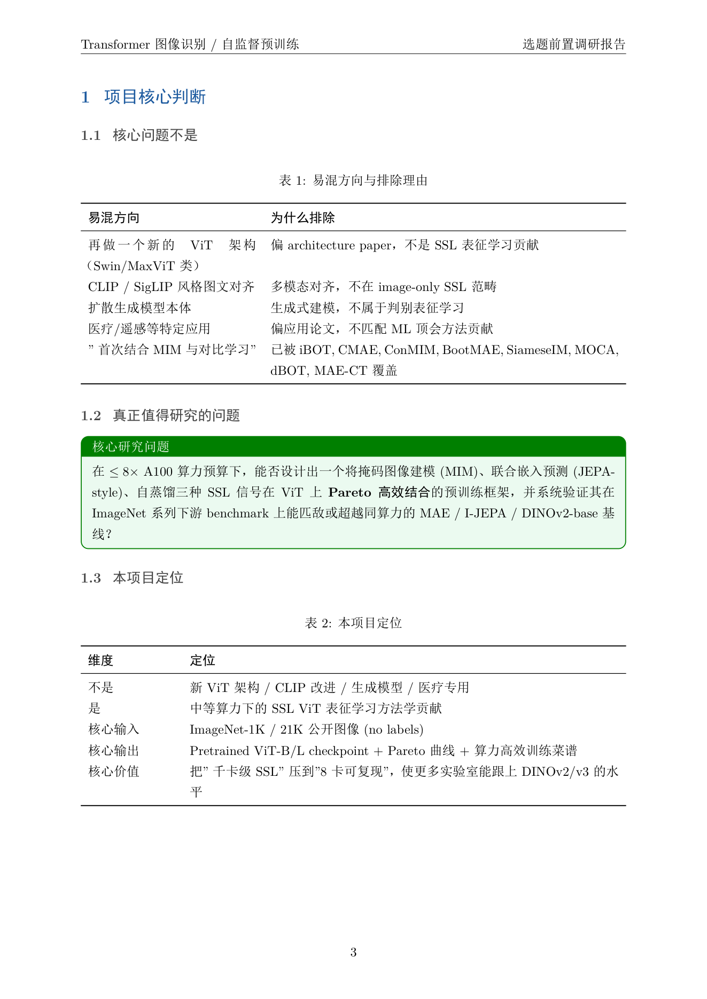
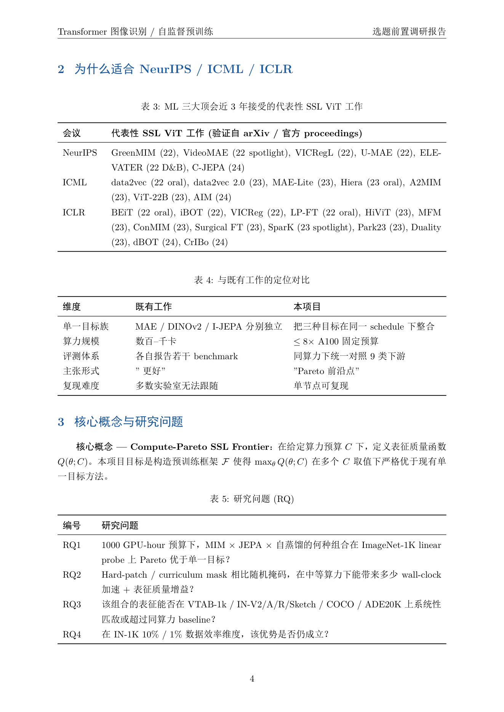
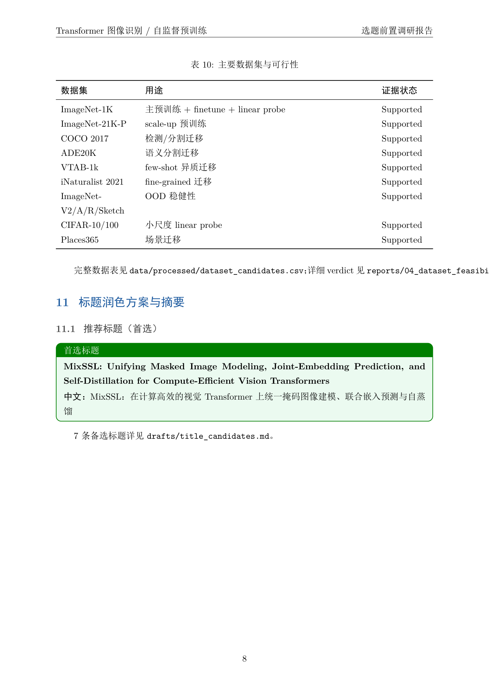
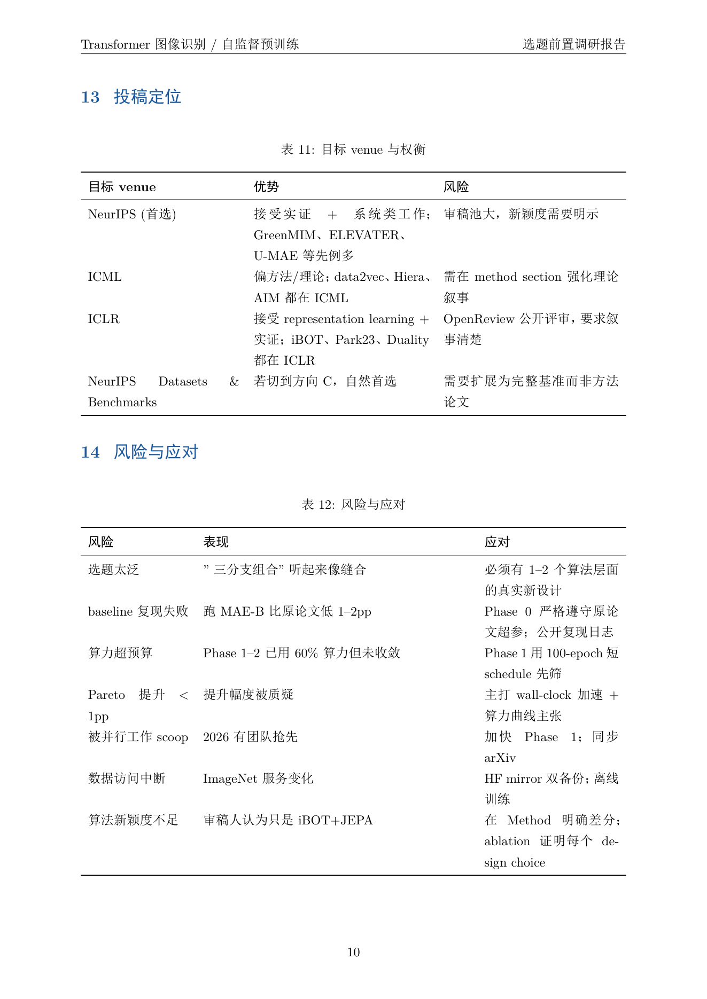

<p align="center">
  
</p>

<h1 align="center">Academic Topic Research Agent</h1>

<p align="center">
  把一句话研究想法 → 一份能拍给导师看的中文调研报告
</p>

---

## 这玩意儿到底是什么

就是一个 skill。你装到 Claude Code 或者 OpenAI Codex 里，跟它说一句你正在琢磨的研究方向，它会给你产出一份中文调研报告。结构是参考 NeurIPS、ICML、ICLR、CHI、LAK 这类顶会前期调研的方式来的：项目核心判断、为什么适合这个 venue、跟前人工作的差异、数据可行性、风险与时间表，全套。

Markdown、LaTeX、PDF 三种格式同时出（本机有 TeX 环境才会编 PDF）。

我不太想用"研究助手"这种词来包装它。说白了它就是把"我有个想法 → 导师能看的方案"这条路上你本来要做的烂活——搜文献、整理元数据、看公开数据集能不能用、查近三年这个会都收了什么类型的工作、写一遍可行性、起几个标题、排版——批量替你做了。

---

## 我自己为啥写这个

说实话，写这个是因为我被坑过太多次了。

之前有一次，导师扔过来一个方向让我调研一周。我打开 Google Scholar，搜了一上午，标签页开到 50 多个。中午想偷个懒，转头问 GPT："xxx 方向最近三年都有谁在做？" GPT 一口气给了我 12 篇论文，作者、年份、标题看上去都很正常。我心情大好，复制到 Notion 里，准备整理。

结果第二天发现，里面有 4 篇是它编的——作者是真的，年份是真的，DOI 是它根据文章题目瞎拼的，论文不存在。

那一刻我有点崩溃。不是因为 GPT 错了——它本来就会错——而是我意识到，"我以为我在做调研，其实我在帮 GPT 校对它的胡说"。

更崩溃的是，等我把这周的"调研"发给导师，他三秒钟就问了一个问题：

> "你这个跟 CMU 那篇 24 年的工作差异在哪？"

我答不上来。因为我搜了 50 篇，但我没真的把它们摆在一张表上比过——我只是把标题往文档里贴。导师不是要看链接，他要看的是**判断**。

这个 skill 就是为这种时刻写的。它会在你点"开始搜文献"之前先停下来，把"你到底想干嘛"这件事问清楚（主题、目标会议、想搜多深、数据从哪来）。然后它会按一套**不让自己编造**的规则去做——遇到验证不了的来源，它会标 `Unknown`、`TODO`、`Requires Manual Verification`，绝不胡说一个 DOI 出来。最后它给你一份能直接发给导师的报告，导师问"差异在哪"，你能在第二页就指给他看。

---

## 跟我直接用 GPT 搜一下有啥不一样

我知道很多人会这么想，因为我自己也这么想过。差异其实不在"它更聪明"，反而在"它更克制"。

**它会先问你。** 你扔一句"帮我调研 xxx 方向"过去，它不会立刻开搜。它会问你四件事——主题确认、目标会议、想搜多深（10-20 篇 / 30-50 篇 / 80-120 篇）、数据从哪来（公开数据集还是要做用户研究）。一次性问完，回答完才开始干活。听起来啰嗦，但少了这一步，搜出来的东西很容易跑偏，最后写出来发现根本不是你想做的方向。

**它不会瞎编文献。** 这点写在 skill 的硬约束里了。来源验不了，它就标 `Unknown` 或 `TODO`，宁可少写一行，也不给你一个假 DOI。我做这个的初衷之一就是这个——我自己被编造的论文坑过，不想再被坑一次。

**它不会拍胸脯说"没人做过"。** 这是 GPT 最容易掉的坑——你问它新颖性，它一上来就告诉你这个方向很新。skill 里强制了一个句式："**在本次检索范围下**，A 和 B 已经被覆盖，但比较少看到同时结合 A+B+C 并落在 D 场景的工作。" 它给的是探索结论，不是宇宙真理——你后面有的找的时候，不会被自己一开始的话打脸。

**它真的会查数据可行性。** 你要做这个方向，公开数据集够不够？ImageNet 还是 CIFAR 还是要自己标？做用户研究的话访谈几个人才够？它会把每个候选数据集去核 access page、license、样本量、和你课题的匹配/不匹配，然后给一个 `Pass / Weak Pass / Fail` 的判定，再附几条"如果不 Pass 你可以走什么路线"——形成性访谈、Wizard-of-Oz、vignette、标注协议、benchmark 构建。这些不是它编的，是从协议里查出来的。

**它会防止你跑偏。** 这个我挺喜欢。你一开始说要研究 A，搜着搜着发现 B 方向数据特别好找，文献也很多，你可能不自觉就开始写 B 了。skill 里有个 `topic_lock.yaml` 把你最初的意图锁住，后面任何一个模块只要发现产出和最初意图有偏差，就会写一份 `05_topic_drift_warning.md` 给你提个醒。

**它给的不是链接。** GPT 给你链接列表你自己整理；skill 给你一个 24 列的 CSV（题目、作者、年份、venue、方法、数据、贡献、局限、和你课题的关系、覆盖了哪些维度、还差哪些维度），你可以直接 Excel 打开排序、筛选、画图。如果你做 deep 模式（80-120 篇），这个 CSV 就是你写 related work section 的脚手架。

**它给的是导师能签字的报告，不是聊天记录。** 输出是 Markdown + LaTeX + PDF（如果你本机有 TeX），不是一堆要素堆叠的对话气泡。LaTeX 用的是 ctex + tcolorbox，深蓝色的核心判断框、表格、章节自动编号，发出去就是论文方案那种感觉。

不过我也得承认一件事：**这个 skill 不能替你判断**。它能把"看得见的工作"列清楚，但"这个方向值不值得做"——这个判断还是得你来。它最多在 `06_final_recommendation.md` 里写一个"推进 / 收窄 / 重做"的建议，但那个建议要不要听，是你的事。

---

## 截图

这是用它做出来的一份真实报告（主题是 Transformer 自监督预训练，瞄准 NeurIPS/ICML/ICLR）：

<table>
  <tr>
    <td align="center" width="50%">
      <br/>
      <sub>封面 + 一句话概括。蓝框写出"方向值得做，但要收窄到这个具体题面"——不是简单说 yes/no</sub>
    </td>
    <td align="center" width="50%">
      <br/>
      <sub>项目核心判断。"易混方向与排除理由"——这是导师追问"你这个跟 Swin/MaxViT 有啥区别"时你的答案</sub>
    </td>
  </tr>
  <tr>
    <td align="center">
      <br/>
      <sub>为什么适合这个 venue。会议-代表性工作对照表，让导师看到"近三年这个会都收什么风格"</sub>
    </td>
    <td align="center">
      <br/>
      <sub>主要数据集与可行性。每个数据集都有"证据状态"列——Supported 就是真去翻过 access page</sub>
    </td>
  </tr>
</table>

<p align="center">
  <br/>
  <sub>投稿定位表。NeurIPS / ICML / ICLR 各自的优势和风险，导师问"投哪个会"你不用现想</sub>
</p>

---

## 怎么装

### Claude Code

```bash
# 进到 Claude Code 的 skills 目录
cd ~/.claude/skills                     # macOS / Linux
# Windows: cd "$env:USERPROFILE\.claude\skills"

git clone https://github.com/handsomeZR-netizen/academic-topic-research-agent.git
```

下次启动 Claude Code 会自动加载。然后就是直接跟它说话：

```
我在琢磨一个方向，想用图神经网络做药物-靶点相互作用预测，
想投 NeurIPS 或 ICLR，帮我做一份 standard 深度的调研报告。
```

它会先停下来问你 3-4 件事（确认主题、确认 venue、数据从哪来、有没有已经写好的 proposal），你回答完它才开始搜。

### OpenAI Codex

同样的 clone 法，放到 Codex 的 agents 目录就行。仓库自带 `agents/openai.yaml`，Codex 会读它。

### 想要 PDF 的话

默认输出 Markdown 和 LaTeX。PDF 只在你本机有 TeX 时才编——需要 `xelatex` + `ctex` + 中文字体（macOS 都有；Windows 装宋体/黑体/楷体/仿宋；Linux 装 `fonts-noto-cjk`）。Pandoc 装上的话 Markdown → LaTeX 转换更精细，没装也能跑（会用一个保守的 fallback 转换器）。

如果环境缺东西，它会告诉你缺什么，不会装作成功了：

```
PDF 跳过：本机未检测到 xelatex / latexmk。Markdown 与 LaTeX 已生成，
可以在有 TeX 环境的机器上用 xelatex 编译。
```

---

## 三档深度怎么选

| 深度 | 大概多少篇 | 适合啥时候用 |
|---|---:|---|
| `quick` | 10-20 篇 | 临时被问到一个方向，半小时内想知道"这方向有没有人做过、坑在哪" |
| `standard` | 30-50 篇 | 正经的前期调研，导师下周要看（**默认这一档**） |
| `deep` | 80-120 篇 | 开题报告、博士选题、想做"完整文献网"的那种系统性扫描 |

数量只是一方面，更重要的是质量阈值——至少 1/3 的文献要达到 `keep` 或 `background` 级别，纯候选不算数。

---

## 它不能干啥（承认一下）

- **它不能替你判断**。能告诉你"这个方向 87 篇相关文献"，但"值不值得做"是你的判断。
- **它对完全冷门的方向会缩水**。如果你的主题就是只有 5 个人在做，deep 模式也搜不到 80 篇，它会如实告诉你上限是多少，不会凑数。
- **中文期刊覆盖一般**。默认开的是 OpenAlex / Crossref / DBLP / Semantic Scholar，CNKI / 万方默认是关的。你可以自己在 `config/sources.yaml` 里加，但加完它得真能爬到才行。
- **它不会下载付费 PDF**。只下 OA 的或者你自己给它的文件。如果你想看的论文是 ACM/IEEE 付费的，它只会收元数据，PDF 你得自己想办法。
- **PDF 编译是可选的**。没装 TeX 的话只有 MD + LaTeX，需要你去有 TeX 的机器上编。

---

## 目录长这样

```
academic-topic-research-agent/
├── SKILL.md                            # Claude Code 入口
├── agents/openai.yaml                  # OpenAI Codex 入口
├── references/                         # skill 操作手册
│   ├── workflow.md                     # 7 模块菜单
│   ├── intake_questions.md             # 主动询问脚本（双格式）
│   ├── search_protocol.md              # 三档检索 + 法律 PDF 政策
│   ├── dataset_protocol.md             # 数据可行性 Pass/Weak/Fail
│   ├── report_style.md                 # v2 风格 + 环境依赖
│   ├── schemas.md                      # CSV/YAML/JSONL 模板
│   └── evidence_rules.md               # 不可编造红线
└── assets/
    ├── report-blueprint/               # v2 最小骨架（MD + LaTeX）
    ├── project-template/               # 用户项目目录模板
    │   ├── config/                     # topic_input / topic_lock / sources / tag_schema.example
    │   ├── data/processed/             # CSV 输出
    │   ├── reports/                    # 00-06 阶段产物
    │   ├── drafts/                     # 标题/摘要/实验设计草稿
    │   └── scripts/                    # render_report.py / workflow_checklist.py
    └── screenshots/                    # 这个 README 用的截图
```

---

## License

MIT。随便用、随便改、随便做你自己学科的变体。如果你做出来的版本不错，欢迎回来告诉我。
