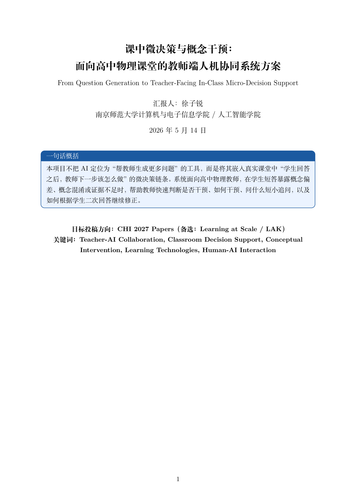
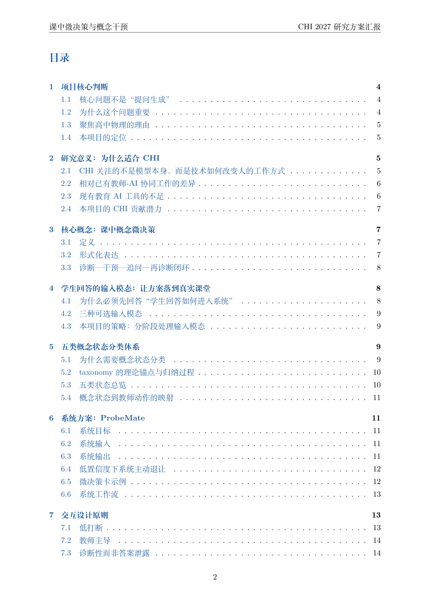
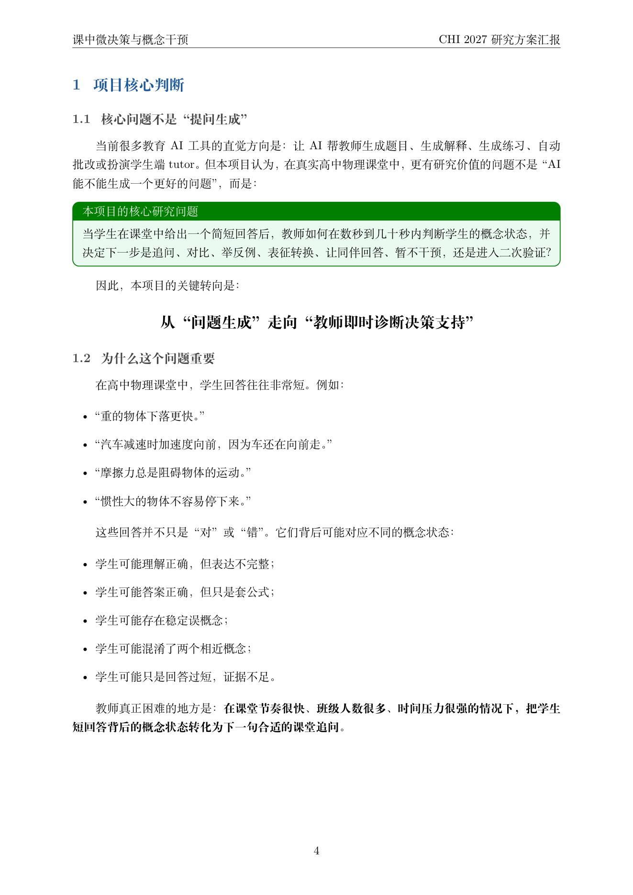
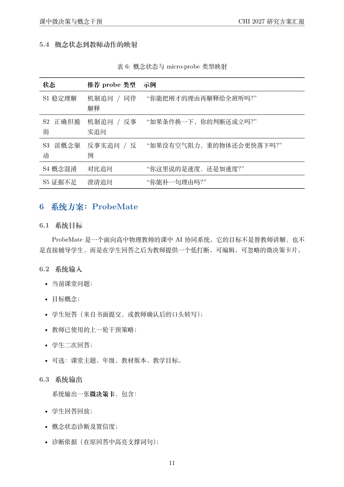
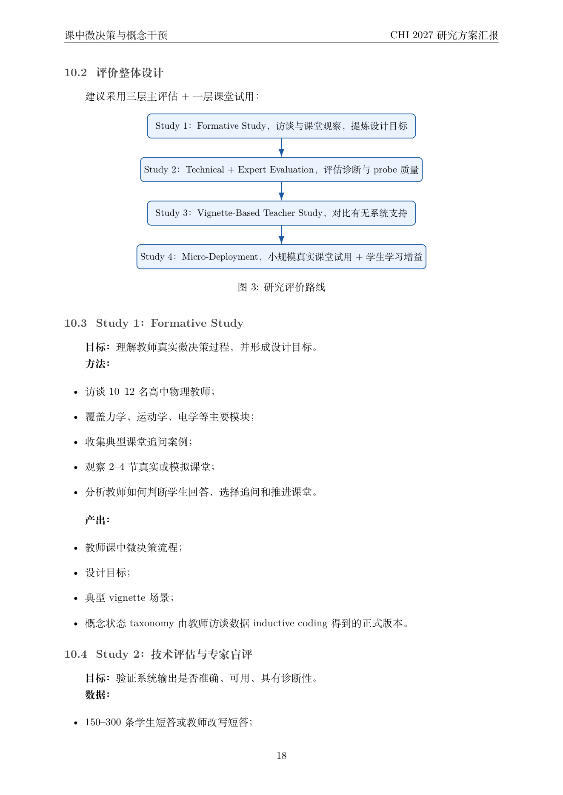
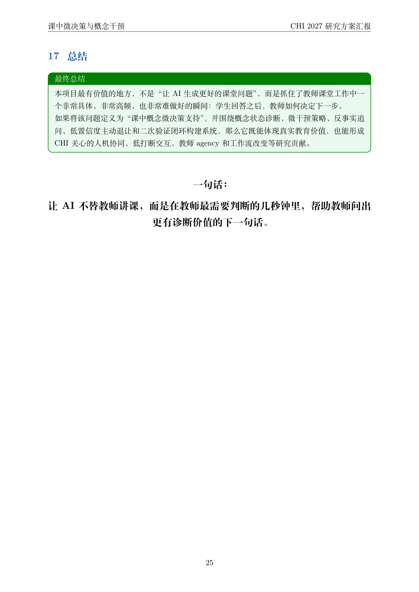

<p align="center">
  
</p>

<h1 align="center">Academic Topic Research Agent</h1>

<p align="center">
  <b>中文默认的学术选题前置调研开发包</b><br/>
  把一句话研究想法 → 变成导师能看的 v2 风格调研报告
</p>

<p align="center">
  <a href="#你是不是经历过这种事">扎心场景</a> ·
  <a href="#它是什么">是什么</a> ·
  <a href="#跟普通-web-搜索--gpt-到底有什么不同">为什么不是用 GPT</a> ·
  <a href="#效果截图">效果截图</a> ·
  <a href="#5-分钟上手">5 分钟上手</a>
</p>

---

## 你是不是经历过这种事

> **导师**："去把这个方向调研一下，下周给我看。"
> **你**：（打开 Google Scholar / 知网 / 百度学术）……搜了 3 小时，标签页开了 50 个，**啥也没整理出来**。

> **你**：（转头问 GPT）"帮我调研一下 xxx 方向。"
> **GPT**：编了 5 篇不存在的论文，作者名是真的，**DOI 是假的**。等你发现的时候导师已经追问了。

> **你**：（终于熬出来一份 Word 文档）……导师看了三句话：
> "**核心判断是什么？数据从哪来？跟前人的工作差异在哪？为什么投这个会？**"
> 你一个都答不上。

> **你**：（想做"完整版前期调研"）……手动整理 100 篇论文的元数据、写一遍可行性、列一遍标题候选、再排一遍版……**整整一周，连摘要都还没动**。

如果上面有任何一句戳到你，**这个 skill 就是为你写的**。

---

## 它是什么

一句话：**把"一句话研究想法" → 一份"可以直接拍给导师"的 CHI 风格中文调研报告，中间所有的烂活我们替你做了。**

具体一点：这是一个 **Claude Code + OpenAI Codex 双平台** 的 skill（技能包），按 CHI / LAK / L@S / AIED / CSCW 等顶会前期调研的标准，帮你完成从文献元数据搜集 → 数据可行性判断 → 标题摘要候选 → v2 风格 Markdown/LaTeX/PDF 报告的**全套流水线**。

**它会替你做的事：**

| 阶段 | 你只需要给一句话主题 + 目标 venue | 它会产出 |
|---|---|---|
| 1 · 主动询问 | 主题、目标会议、深度、数据类型缺哪个 → 它会先停下来一次性问齐 | `config/topic_input.yaml` 填好的版本 |
| 2 · 文献元数据 | 三档深度可选：quick 10-20 篇 / standard 30-50 篇 / deep 80-120 篇 | `paper_matrix.csv` + 证据轨迹 |
| 3 · 数据可行性 | 自动搜公开数据集、benchmark、研究路径 | `Pass / Weak Pass / Fail` 三档判定 |
| 4 · 标题摘要 | 3-8 个标题候选（保守 / venue-fit / 大胆 / 方法导向）+ 1-3 段摘要 | `title_candidates.md` + `abstract_candidates.md` |
| 5 · v2 报告 | 17 节骨架（quick 任务自动精简到 5-7 节） | `final_topic_report.md` + `.tex` + `.pdf` |

**适合谁用：**
- 研究生准备开题、调研、找方向、找 CHI/LAK 之类的目标 venue
- 老师/博后想快速评估一个学生想法的可行性
- 已经写了一段 idea，想知道有没有"被人做过"、能不能投这个会
- 想做"100 篇论文级别"的完整文献网络但不想手工筛 3 天

---

## 跟普通 web 搜索 / GPT 到底有什么不同

很多人会问：**"我直接 Google Scholar / 百度学术 / ChatGPT 一下不就行了？"**——这是最高频的问题。我们逐项对比，**这也是这个 skill 存在的全部理由**：

| 你的痛点 | 普通 web 搜索 / GPT 的表现 | 本 skill 怎么做 |
|---|---|---|
| **"GPT 编了一篇不存在的论文，我引用进去差点出大事"** | 没有任何防伪——作者真、年份假、DOI 是瞎拼的 | **硬约束不准编造**：来源不可验证一律标 `Unknown` / `TODO` / `Requires Manual Verification`，宁可少给也不胡说 |
| **"我问 GPT 这个方向有没有人做过，它说没有，我兴奋了一周，结果被导师秒锤"** | 容易拍胸脯说"没人做过" | 强制安全句式："**在本次检索范围下**，A、B 已被覆盖，但**少见**同时结合 A+B+C 并落在 D 场景的工作"——给的是探索结论，不是宇宙真理 |
| **"探索得一点都不深入，搜了 30 个链接还是不知道前人怎么做的"** | 给一堆标题让你自己读 | 三档深度（10-20 / 30-50 / 80-120 篇）+ 自动聚类、归类、找差距，**最后给一张 prior-work 对比表**，而不是一堆链接 |
| **"整理太麻烦了，标签页开了 50 个，根本不想再点第 51 个"** | 整理工作全部丢给你 | 自动写进 `paper_matrix.csv`（24 列，含主题、方法、数据、贡献、limitations、和本课题的关系），可以直接 Excel/Notion 打开排序 |
| **"导师问'数据从哪来'，我支吾了 10 秒"** | 完全不管数据 | 必做 `Pass / Weak Pass / Fail` 三档判定 + 给替代研究路径（Wizard-of-Oz / vignette / 形成性访谈），导师面前可以 1 秒答 |
| **"搜着搜着就跑偏了，最后写的方向跟一开始想的不是一个东西"** | 容易被"好搜的数据"或"热门话题"带偏 | 有 `topic_lock.yaml` 把原意锁住；后续模块只要偏离就自动写 `05_topic_drift_warning.md` 警告你 |
| **"我也不知道这个方向投哪个会合适"** | 不给定位建议 | 标题候选直接做 4 种 venue 适配（保守 / CHI 风 / 大胆 / 方法导向），还有 `06_final_recommendation.md` 给 **推进 / 收窄 / 重做** 决断 |
| **"我没时间排版，但导师要 PDF"** | 给你一堆 Markdown 自己折腾 | 输出 Markdown + LaTeX + PDF（本机有 TeX 时自动编译），用 `ctexart` + tcolorbox 蓝色框，直接是 v2 风格的成品 |
| **"我搜的全是英文论文，中文期刊一篇都没看到"** | 中文期刊覆盖一般 | `config/sources.yaml` 默认开 OpenAlex/Crossref/DBLP/Semantic Scholar，你可以自己加 CNKI/万方 |
| **"GPT 让我下了一堆付费 PDF，结果被学校 IP 封了"** | 不管法律合规 | 只下 OA PDF 或你提供的文件，付费内容只收元数据 |

**一句话总结：** 普通搜索给你**链接**；GPT 给你**编造的链接**；这个 skill 给你**导师能签字的研究方案**——从"我有个想法"到"PDF 在邮箱里"全打通了。

---

## 效果截图

这是用本 skill 产出的真实 v2 风格报告（CHI 2027 投稿方向「课中微决策与概念干预」）：

<table>
  <tr>
    <td align="center" width="50%">
      <br/>
      <sub><b>① 封面 + 一句话概括</b><br/>蓝色 tcolorbox 框出核心立场，目标会议/关键词一目了然</sub>
    </td>
    <td align="center" width="50%">
      <br/>
      <sub><b>② 17 节骨架目录</b><br/>从核心判断到风险时间表，导师 1 分钟就能浏览结构</sub>
    </td>
  </tr>
  <tr>
    <td align="center">
      <br/>
      <sub><b>③ 项目核心判断</b><br/>"核心问题不是…而是…"——v2 风格的标志性论证</sub>
    </td>
    <td align="center">
      <br/>
      <sub><b>④ 概念状态 → 教师动作映射表</b><br/>每篇 v2 报告至少 5 张表：定位 / 先驱 / 数据 / 评价 / 风险</sub>
    </td>
  </tr>
  <tr>
    <td align="center">
      <br/>
      <sub><b>⑤ 评价整体设计</b><br/>4 个 Study 串成路线：Formative → Tech/Expert → Vignette → Micro-deployment</sub>
    </td>
    <td align="center">
      <br/>
      <sub><b>⑥ 最终总结</b><br/>回到一句话立场——这是导师审阅时最先读、最后读的部分</sub>
    </td>
  </tr>
</table>

---

## 5 分钟上手

### 安装到 Claude Code

```bash
# 把本仓库 clone 到 Claude Code 的 skills 目录
cd ~/.claude/skills        # macOS / Linux
# 或 Windows: cd "$env:USERPROFILE\.claude\skills"

git clone https://github.com/handsomeZR-netizen/academic-topic-research-agent.git
```

下次启动 Claude Code 时，skill 会自动加载。**触发方式**：

```
你: 帮我把"用 AI 辅助高中物理老师做课堂决策"这个想法做成 CHI 风格的中文调研报告，standard 深度。
```

skill 会**先停下来问你 4 个问题**（主题确认、目标 venue、深度、数据类型），你一次回完后才开始搜文献。

### 安装到 OpenAI Codex

同样 clone 到 Codex 的 agents 目录即可。仓库自带 `agents/openai.yaml`，Codex 会自动注册：

```yaml
short_description: "中文默认的学术选题前置调研开发包：三档文献元数据、v2 风格 Markdown/LaTeX/PDF 报告、标题/摘要候选、数据可行性"
allow_implicit_invocation: true
```

### 想要 PDF 的话

skill 默认输出 Markdown + LaTeX。**PDF 是可选的**，需要本地有：

- `xelatex`（TeX Live / MacTeX / MikTeX 任一）
- `ctex` 宏包（`tlmgr install ctex`）
- 中文字体（macOS 自带；Windows 需宋体/黑体/楷体/仿宋；Linux 需 `fonts-noto-cjk`）
- Pandoc（可选，提高 Markdown → LaTeX 转换保真度）

如果环境缺组件，skill 会**明确告诉你缺什么**——不会静默失败：

```
PDF 跳过：本机未检测到 xelatex / latexmk。Markdown 与 LaTeX 已生成，
可在有 TeX 环境的机器上用 xelatex 编译。
```

---

## 完整用法

### 三档深度怎么选

| 深度 | 文献元数据量 | 适合场景 | 大概耗时 |
|---|---:|---|---:|
| `quick` | 10-20 篇 | 快速定方向、标题润色、写 1 页备忘录 | 10-20 分钟 |
| `standard` | 30-50 篇 | 标准前期调研，含完整 v2 报告（**默认**） | 40-90 分钟 |
| `deep` | 80-120 篇 | "100 篇文献网"、系统性扫 venue、博士开题 | 2-4 小时 |

**质量阈值**：不只是数量——至少 ⅓ 的文献要达到 `keep` 或 `background` 级别，纯 `candidate` 不算数。

### 7 个可组合模块

skill 不是死板流水线，是**模块菜单**。assistant 会根据你的需求挑：

```
Module A · Intent & Boundary    →  topic_lock.yaml
Module B · Metadata Reconnaissance →  paper_matrix.csv + evidence_trace.jsonl
Module C · Evidence Map & Gap   →  gap_matrix.md
Module D · Dataset Feasibility  →  dataset_candidates.csv + Pass/Weak/Fail
Module E · Research Design      →  experiment_plan.md
Module F · Title & Abstract     →  title_candidates.md + abstract_candidates.md
Module G · v2 Final Report      →  final_topic_report.md/.tex/.pdf
```

### 进度自检

任何时候想看"还差什么没做"：

```bash
python assets/project-template/scripts/workflow_checklist.py --list
```

输出每个模块该有什么产物，对照一下就知道还缺哪些。

### 主动询问示例

如果你只给一句话，skill 会用这种格式问你（同时支持 Markdown 编号清单和 Claude Code 的 `AskUserQuestion` 卡片）：

```
为了把调研做扎实，我先确认几件事，你可以一次性回答：

1. 研究主题 / 核心问题？（一两句话即可）
2. 目标会议或期刊？（CHI / LAK / L@S / AIED / EDM / CSCW / IJHCI / 中文期刊 / 其他）
3. 想做多深？（quick 10-20 / standard 30-50 / deep 80-120）
4. 数据 / 研究类型？（公开数据集 / 课堂数据 / 访谈·WoZ / 标注 / vignette / 待定）

如果方便，再补充：年份范围、必含/必避关键词、是否有 proposal/PDF、时间预算、输出语言。
```

回答完后，所有答案会被写进 `config/topic_input.yaml`，**然后**才开始搜文献。

---

## 目录结构

```
academic-topic-research-agent/
├── SKILL.md                            # 主入口（Claude Code 读这个）
├── agents/openai.yaml                  # OpenAI Codex 入口
├── references/                         # assistant 操作手册
│   ├── workflow.md                     # 7 模块菜单
│   ├── intake_questions.md             # 主动询问脚本（双格式）
│   ├── search_protocol.md              # 三档检索 + 法律 PDF 政策
│   ├── dataset_protocol.md             # 数据可行性 Pass/Weak/Fail
│   ├── report_style.md                 # v2 风格指南 + 环境依赖
│   ├── schemas.md                      # CSV/YAML/JSONL 模板
│   └── evidence_rules.md               # 不可编造 + 安全新颖性
└── assets/
    ├── report-blueprint/               # v2 最小报告骨架（MD + LaTeX）
    ├── project-template/               # 用户项目起手目录
    │   ├── config/                     # topic_input / topic_lock / sources / tag_schema.example
    │   ├── data/processed/             # CSV 输出目录
    │   ├── reports/                    # 00-06 阶段产物
    │   ├── drafts/                     # 标题/摘要/实验设计草稿
    │   └── scripts/                    # render_report.py / workflow_checklist.py
    └── screenshots/                    # 本 README 用的截图
```

---

## 核心原则（不可编造红线）

skill 内置了一组**强制约束**，写在 `references/evidence_rules.md`：

- **不编造**任何论文、引用、数据集、被试数、指标、结果、部署、研究发现
- **不把可能的想法说成事实**——没有证据的，全部标 `Unknown` / `TODO`
- **不声明全局新颖性**，除非检索范围确实覆盖了那个具体声明
- **不悄悄改主题去迁就好找的数据**——发现偏离会写 `topic_drift_warning.md`
- **不引用没核实过 access page 的数据集**
- **不下载付费/许可受限的 PDF**

这是这个 skill **跟通用 LLM 最大的区别**：不是更聪明，是**更克制**。

---

## FAQ

**Q：跟 Elicit / ResearchRabbit / Consensus 这些工具有什么不同？**
A：那些是**文献检索工具**，给你论文列表；这个是**前期调研开发工具**，把论文列表 → 数据可行性 → 标题摘要 → 完整研究方案串成一条流水线，并输出可发导师的 PDF。它能配合 Elicit 等工具用——你把它们的输出粘进来，skill 接着做后面的事。

**Q：我没装 LaTeX 怎么办？**
A：照样能用。skill 输出 Markdown 是默认产物；LaTeX 是结构化版本，PDF 只是 LaTeX 的渲染。没 TeX 环境就只产 MD + LaTeX，等到了有 TeX 的机器再编译。

**Q：能不能用英文输出？**
A：能。在 intake 阶段把 `output_language` 设为 `English` 即可。但默认中文——`v2 风格`本身是中文学术写作风格，硬翻译效果不好。

**Q：deep 模式真的能搜到 100 篇吗？**
A：取决于主题热度。冷门方向可能 60-80 篇就到天花板，skill 会**如实说明上限**，而不是凑数。

**Q：能搜中文期刊吗？**
A：能。`config/sources.yaml` 默认启用 OpenAlex / CrossRef / DBLP / Semantic Scholar，覆盖部分中文期刊；CNKI/万方在 sources.yaml 里默认不开启，你可以自己加。

---

## 致谢与许可

- **风格灵感**：所有 v2 风格细节来自我个人多份中文研究方案的写作经验，骨架经过多轮对中文 CHI/LAK 投稿者的使用迭代。
- **截图来源**：README 中的报告截图来自我本人的 CHI 2027 投稿方向「课中微决策与概念干预 / ProbeMate」研究方案，**作为 v2 风格的真实参考样例**。
- **License**：MIT。欢迎二次开发、改造、做你自己学科领域的变体。

---

<p align="center">
  <sub>Made for researchers who want to stop wasting time on "what's already been done" and start writing what's worth doing.</sub>
</p>
